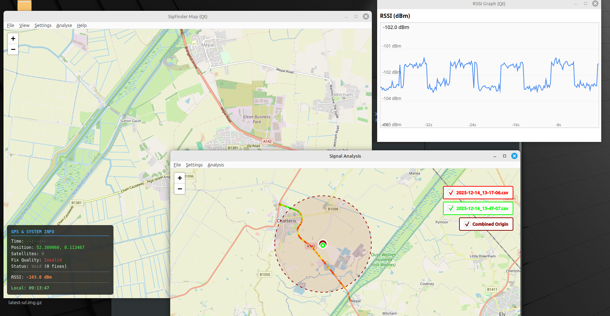

# SigFinder - GPS + SDR Signal Mapper

GPS-based signal strength mapping tool supporting ADALM-Pluto, SDRplay, and RTL-SDR hardware with real-time visualization and CSV logging.



## Quick Start

### 1. Install System Dependencies

First, install required Qt6 libraries:

```bash
./install_system_deps.sh
```

This installs: `libxcb-cursor0`, `libqt6qml6`, and other Qt6 dependencies needed by PyQt6.

### 2. Install SDR Hardware Dependencies

**IMPORTANT:** SoapySDR Python bindings cannot be installed via pip. They must be installed system-wide using your package manager before creating the Python virtual environment. The venv will automatically find the system-installed SoapySDR module.

**For ADALM-Pluto:****
```bash
./install_adalm_deps.sh
```

**For SDRplay:**

SDRplay devices require SoapySDR and the SDRplay API:

1. Install SoapySDR system packages:
```bash
# Debian/Ubuntu
sudo apt-get install -y soapysdr-tools libsoapysdr-dev python3-soapysdr

# Fedora/RHEL
sudo dnf install -y SoapySDR SoapySDR-devel python3-SoapySDR
```

2. Install SDRplay API from https://www.sdrplay.com/downloads/
   - Download the appropriate installer for your platform
   - Extract and run the installer script
   - This provides the necessary drivers and libraries

3. Install SoapySDRPlay plugin:
```bash
# Clone and build SoapySDRPlay
git clone https://github.com/pothosware/SoapySDRPlay.git
cd SoapySDRPlay
mkdir build && cd build
cmake ..
make
sudo make install
sudo ldconfig
```

4. Verify SDRplay is detected:
```bash
SoapySDRUtil --find="driver=sdrplay"
```

**For RTL-SDR:**

RTL-SDR devices (RTL2832U-based DVB-T dongles) require SoapySDR and RTL-SDR drivers:

1. Install SoapySDR and RTL-SDR packages:
```bash
# Debian/Ubuntu
sudo apt-get install -y soapysdr-tools libsoapysdr-dev python3-soapysdr rtl-sdr librtlsdr-dev soapysdr-module-rtlsdr

# Fedora/RHEL
sudo dnf install -y SoapySDR SoapySDR-devel python3-SoapySDR rtl-sdr rtl-sdr-devel soapy-sdr-rtlsdr
```

2. Blacklist DVB-T kernel modules (prevents conflicts):
```bash
echo 'blacklist dvb_usb_rtl28xxu' | sudo tee /etc/modprobe.d/blacklist-rtl.conf
sudo rmmod dvb_usb_rtl28xxu 2>/dev/null || true
```

3. Add udev rules for device access:
```bash
sudo wget -O /etc/udev/rules.d/20-rtlsdr.rules https://raw.githubusercontent.com/osmocom/rtl-sdr/master/rtl-sdr.rules
sudo udevadm control --reload-rules
sudo udevadm trigger
```

4. Verify RTL-SDR is detected:
```bash
SoapySDRUtil --find="driver=rtlsdr"
# or
rtl_test -t
```

### 3. Create Python Virtual Environment

```bash
./venv_setup.sh
```

This creates a `.venv` and installs all Python packages from `requirements.txt`.

### 4. Run the Application

**With ADALM-Pluto (default):**
```bash
./run.sh --gps-port /dev/ttyUSB0 --gps-baud 4800 --freq 869.615 --gui --rx-bw 8
```

**With SDRplay:**
```bash
./run.sh --sdr-type sdrplay --sdr-gain 40 --gps-port /dev/ttyUSB0 --gps-baud 4800 --freq 869.615 --gui --rx-bw 8
```

**With RTL-SDR:**
```bash
# With manual gain (0-50 dB)
./run.sh --sdr-type rtlsdr --sdr-gain 40 --gps-port /dev/ttyUSB0 --gps-baud 4800 --freq 869.615 --gui --rx-bw 8

# With automatic gain control (AGC)
./run.sh --sdr-type rtlsdr --sdr-gain 0 --gps-port /dev/ttyUSB0 --gps-baud 4800 --freq 869.615 --gui --rx-bw 8
```

**Command-line options:**
- `--sdr-type`: SDR hardware type: `pluto` (default), `sdrplay`, or `rtlsdr`
- `--sdr-gain`: SDR gain in dB (for SDRplay/RTL-SDR, default: 40.0; use 0 or negative for RTL-SDR AGC)
- `--gps-port`: Serial port for GPS receiver (e.g., `/dev/ttyUSB0`)
- `--gps-baud`: Baud rate (typically 4800 or 9600)
- `--freq`: SDR frequency in MHz (e.g., 869.615)
- `--gui`: Launch PyQt6 GUI
- `--rx-bw`: Receiver bandwidth in kHz (e.g., 8)
- `--pluto-uri`: Optional Pluto URI (defaults to auto-detection)
- `--rssi-offset`: Calibration offset in dB to adjust RSSI readings (default: 0.0)
- `--debug`: Enable debug output

### RSSI Calibration

Different SDR hardware has different RSSI calibration:

- **ADALM-Pluto**: Raw dBFS values are negated to display as dBm
- **SDRplay**: dBFS values displayed directly
- **RTL-SDR**: dBFS values offset by -60 dB (e.g., -20 dBFS → -80 dBm)

You can fine-tune RSSI readings using the `--rssi-offset` parameter:

```bash
# If RTL-SDR readings are too high, reduce them by 10 dB
./run.sh --sdr-type rtlsdr --rssi-offset -10 --freq 869.615 --gui

# If readings are too low, increase them by 10 dB
./run.sh --sdr-type rtlsdr --rssi-offset 10 --freq 869.615 --gui
```

**Typical RSSI ranges:**
- Strong signal: -40 to -60 dBm
- Medium signal: -60 to -80 dBm
- Weak signal: -80 to -100 dBm
- Noise floor: -100 to -120 dBm

## Features

- **Multiple SDR hardware support**: ADALM-Pluto, SDRplay (RSP1/RSP2/RSPduo/RSPdx), and RTL-SDR (RTL2832U)
- **Real-time GPS tracking** with OpenStreetMap display
- **Live GPS overlay** showing: Time (UTC), Position, Satellites, Fix Quality, Status, RSSI
- **RSSI graph** with time axis
- **CSV logging** of GPS coordinates and signal strength data
- **Menu-driven interface** with keyboard shortcuts

## GUI Controls

### Menus

**File**
- New Session (Ctrl+N) - Start logging to CSV file
- Stop Session (Ctrl+S) - Stop current logging session
- Exit (Ctrl+Q) - Close application

**View**
- Center on GPS (Ctrl+L) - Center map on current position

**Settings**
- Range Trigger - Configure RSSI threshold

**Help**
- About - Application information

## Requirements

- Python 3.8+
- PyQt6 6.4.2+ with WebEngine
- pyserial, pyadi-iio (for ADALM-Pluto)
- SoapySDR with Python bindings (for SDRplay and RTL-SDR)
- Qt6 system libraries (installed via `install_system_deps.sh`)

**Hardware Support:**
- ADALM-Pluto: Requires pyadi-iio and libiio
- SDRplay (RSP1/RSP2/RSPduo/RSPdx): Requires SoapySDR, SDRplay API, and SoapySDRPlay plugin
- RTL-SDR (RTL2832U-based dongles): Requires SoapySDR, rtl-sdr drivers, and SoapyRTLSDR module

## Troubleshooting

### PyQt6 Issues

If you see errors like "cannot open shared object file", run:

```bash
./install_system_deps.sh
```

### SoapySDR Issues

If you see "No SDRplay devices found" or SoapySDR import errors:

1. Verify SoapySDR Python bindings are installed:
```bash
python3 -c "import SoapySDR; print(SoapySDR.getAPIVersion())"
```

2. Check if SoapySDRPlay plugin is loaded:
```bash
SoapySDRUtil --info
```
Look for "sdrplay" in the available drivers list.

3. Verify SDRplay API is installed:
```bash
ls /usr/local/lib/libsdrplay_api.so* || ls /usr/lib/libsdrplay_api.so*
```

4. If the plugin isn't found, rebuild SoapySDRPlay and ensure SDRplay API is installed first.

5. Device permissions: Add your user to the plugdev group:
```bash
sudo usermod -a -G plugdev $USER
# Log out and back in for group changes to take effect
```

### pyadi-iio Install Issues
---------------------------------

If `pip install -r requirements.txt` fails with an error like:

```
ERROR: Could not find a version that satisfies the requirement pyadi-iio>=0.0.43
```

Then your environment may not have the requested `pyadi-iio` wheel on PyPI or the specific version is unavailable for your platform. Options:

- Use the pinned version in `requirements.txt` (already set to `pyadi-iio==0.0.20`) and run:

```bash
./venv_setup.sh
```

- Install system dependencies (Debian/Ubuntu example) before installing `pyadi-iio`:

```bash
sudo apt-get update
sudo apt-get install -y build-essential pkg-config libxml2-dev libiio-dev libiio1
```

- If you need the bleeding-edge `pyadi-iio`, install directly from the GitHub repository (may require the system deps above):

```bash
source .venv/bin/activate
pip install git+https://github.com/analogdevicesinc/pyadi-iio.git
```

- If installation still fails, check the error messages for missing `libiio` or build tools; install the platform-specific dependencies and retry.

If you tell me your OS/distribution I can provide exact package names and commands.

Automatic ADALM (ADALM‑Pluto) system dependency helper
-----------------------------------------------------

This repository includes `install_adalm_deps.sh`, a helper script that attempts to install common system packages required to use ADALM‑Pluto with `pyadi-iio`.

Usage (Debian/Ubuntu example):

```bash
chmod +x install_adalm_deps.sh
./install_adalm_deps.sh
```

Or let `venv_setup.sh` call it for you when creating the virtualenv:

```bash
./venv_setup.sh --adalm
```

Notes:
- The script attempts `apt` installs on Debian/Ubuntu and `dnf`/`yum` on Fedora/RHEL-like systems. It will print guidance if your distribution is not recognized.
- On older distributions you may still need to build `libiio` from source; see https://github.com/analogdevicesinc/libiio for instructions.
- After system deps are installed, activate the venv and install `pyadi-iio` from GitHub if you need the latest version:

```bash
source .venv/bin/activate
pip install git+https://github.com/analogdevicesinc/pyadi-iio.git
```

